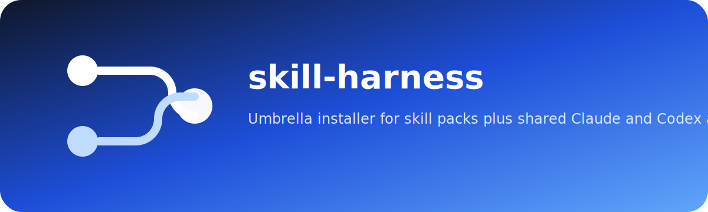

# skill-harness

<p align="center">
  
</p>

<p align="center">
  
</p>

<p align="center">
  <a href="LICENSE"></a>
  
  
  
</p>

`skill-harness` is the umbrella entrypoint for the skill-pack suite. It bootstraps pack repos, installs shared skills into Claude and Codex homes, and installs curated multi-pack agents on top.

## What it installs

- skill packs from the dependent pack repos
- Claude agents from `.claude/agents/*.md`
- Codex agents from `.codex/agents/*.toml`
- a small Codex helper plugin under `plugins/skill-harness-helpers/`

## Included agents

- `requirements-analyst`
- `requirements-analyst-beads`
- `ux-researcher`
- `system-modeler`
- `system-modeler-beads`
- `software-architect`
- `software-architect-beads`
- `web-engineer`
- `backend-engineer`
- `test-designer`
- `test-designer-beads`
- `qa-automation-engineer`
- `quality-reviewer`
- `security-reviewer`
- `security-reviewer-beads`
- `pentest-reviewer`
- `delivery-manager`
- `delivery-manager-beads`
- `research-writer`

## CLI

Build the CLI:

```bash
go build -o skill-harness ./cmd/skill-harness
```

Windows:

```powershell
go build -o skill-harness.exe .\cmd\skill-harness
```

List what is available:

```bash
./skill-harness list
```

Install everything:

```bash
./skill-harness install --all
```

Install selected agents:

```bash
./skill-harness install --agents=requirements-analyst,system-modeler,security-reviewer
```

Install selected packs without agents:

```bash
./skill-harness install --packs=business-analysis-skills,documentation-evidence-skills --packs-only
```

Use the interactive picker:

```bash
./skill-harness install --interactive
```

Check installed agent dependencies:

```bash
./skill-harness check --agents=software-architect,security-reviewer
```

Render Codex agent files only:

```bash
./skill-harness render --agents=test-designer,qa-automation-engineer
```

Remove installed agents:

```bash
./skill-harness uninstall --agents=delivery-manager,delivery-manager-beads
```

## Wrapper scripts

The repo still ships shell wrappers for quick use:

```bash
bash install.sh
bash uninstall.sh --agents=quality-reviewer
```

```powershell
.\install.ps1
.\uninstall.ps1 --agents=quality-reviewer
```

Those wrappers call the Go CLI from the repo root.

## Install behavior

When you install with agent selections, `skill-harness`:

- clones or updates the required pack repos into `~/.skill-harness/packs/`
- syncs packaged skills into `~/.claude/skills/` and `~/.agents/skills/`
- normalizes installed `SKILL.md` files for Codex compatibility
- installs the selected Claude agents into `~/.claude/agents/`
- renders the selected Codex agents into `~/.codex/agents/`
- validates that the selected agents have all required skills installed

With `--all`, it installs every configured pack repo and every shared agent.

## Structure

```text
.claude/agents/*.md                    Claude agents with explicit skill preload lists
.codex/agents/*.toml                   Codex agent profiles
cmd/skill-harness/main.go              Go CLI entrypoint
docs/agent-loadouts.md                 Curated skill mapping per agent
scripts/bootstrap_dependencies.py      Pack bootstrap and skill sync
scripts/check_dependencies.py          Agent dependency verification
scripts/render_codex_agents.py         Codex agent renderer
scripts/normalize_skills.py            Installed skill frontmatter normalizer
plugins/skill-harness-helpers/         Codex helper plugin scaffold
AGENTS.md                              Root guidance for the harness repo
```

## Design

- Pack repos remain the source of truth for reusable skills.
- `skill-harness` is the shared install and orchestration layer.
- Agents stay thin and role-scoped instead of mirroring every pack one-for-one.
- Claude agents preload a tight skill list.
- Codex agents stay repo-scoped and render local `[[skills.config]]` paths.
- Beads variants keep the same core loadout but shift the output toward trackable work items.

## Related Repos

- Pack repos: the topic-focused skill libraries
- `skill-harness`: the umbrella installer and shared multi-pack agent layer

## License

[MIT](LICENSE)
